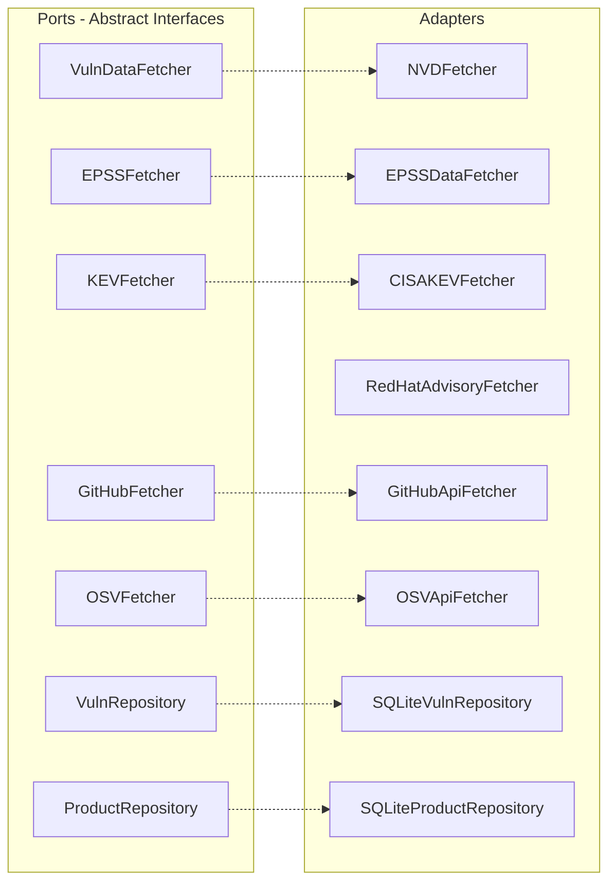

# Data Sources & Adapters

Seclens pulls vulnerability and security data from six external sources plus local persistence. Each external source has a port (abstract interface) and an adapter (concrete implementation).

## Architecture

## Data Sources

### 1. NVD (National Vulnerability Database)

| | |
|---|---|
| **Adapter** | `adapters/fetchers/nvd_fetcher.py` → `NVDFetcher` |
| **Port** | `ports/data_fetchers.py` → `VulnDataFetcher` |
| **API** | NVD API 2.0: `https://services.nvd.nist.gov/rest/json/cves/2.0` |
| **Auth** | Optional API key via `NVD_API_KEY` env var (higher rate limits) |
| **Rate limits** | 5 requests/30s without key, 50/30s with key |
| **Data** | CVE records, CVSS scores, CPE associations, fix version data |

**Key methods**:
- `fetch_all(start_index, batch_size)` — paginated CVE sync
- `fetch_by_cpe_match(cpe_uri)` — CVEs for a specific product
- `fetch_by_keyword(keyword)` — free-text CVE search

### 2. EPSS (Exploit Prediction Scoring System)

| | |
|---|---|
| **Adapter** | `adapters/fetchers/epss_fetcher.py` → `EPSSDataFetcher` |
| **Port** | `ports/data_fetchers.py` → `EPSSFetcher` |
| **API** | FIRST EPSS API: `https://api.first.org/data/v1/epss` |
| **Auth** | None required |
| **Data** | Probability that a CVE will be exploited in the next 30 days |

### 3. CISA KEV (Known Exploited Vulnerabilities)

| | |
|---|---|
| **Adapter** | `adapters/fetchers/kev_fetcher.py` → `CISAKEVFetcher` |
| **Port** | `ports/data_fetchers.py` → `KEVFetcher` |
| **API** | CISA KEV JSON feed: `https://www.cisa.gov/sites/default/files/feeds/known_exploited_vulnerabilities.json` |
| **Auth** | None required |
| **Data** | CVE IDs that have been actively exploited in the wild |

### 4. Red Hat Security Data API

| | |
|---|---|
| **Adapter** | `adapters/fetchers/redhat_fetcher.py` → `RedHatAdvisoryFetcher` |
| **Port** | None (supplementary, not a primary port) |
| **API** | `https://access.redhat.com/hydra/rest/securitydata/cve/{CVE-ID}.json` |
| **Auth** | None required |
| **Data** | RHSA advisory IDs, fix package names, `release_date` for patch velocity |

**Important fields in response**:
- `affected_release[].advisory` — RHSA advisory ID
- `affected_release[].package` — Fixed package name with version
- `affected_release[].release_date` — Date the fix was published (format: `2024-03-14T00:00:00Z`)

**Batch processing**: The adapter uses `asyncio.Semaphore(5)` for concurrent requests to avoid overwhelming the API.

### 5. GitHub REST API

| | |
|---|---|
| **Adapter** | `adapters/fetchers/github_fetcher.py` → `GitHubApiFetcher` |
| **Port** | `ports/github_fetcher.py` → `GitHubFetcher` |
| **API** | `https://api.github.com/repos/{owner}/{repo}/...` |
| **Auth** | Optional `GITHUB_TOKEN` env var (5000 req/hr vs 60/hr) |
| **Data** | SBOM, manifest files, repo metadata, security signals |

**Key endpoints used**:
- `/dependency-graph/sbom` — SPDX SBOM with all dependencies
- `/contents/{path}` — Raw manifest file content (base64 encoded)
- `/branches/{branch}` — Branch protection status
- `/vulnerability-alerts` — Dependabot alert status (204 = enabled)
- `/contents/{config_path}` — Checks for Renovate (`.renovaterc`, `renovate.json`), Dependabot (`.github/dependabot.yml`), and Konflux (`.tekton/`) config files to detect dependency update tooling

**Manifest parser** (`manifest_parser.py`) supports:

| File | Ecosystem | Parser function |
|------|-----------|----------------|
| `requirements.txt` | PyPI | `parse_requirements_txt` |
| `pyproject.toml` | PyPI | `parse_pyproject_toml` |
| `go.mod` | Go | `parse_go_mod` |
| `package.json` | npm | `parse_package_json` |
| `Cargo.toml` | crates.io | `parse_cargo_toml` |
| `pom.xml` | Maven | `parse_pom_xml` |
| `Gemfile` | RubyGems | `parse_gemfile` |

### 6. OSV.dev (Open Source Vulnerabilities)

| | |
|---|---|
| **Adapter** | `adapters/fetchers/osv_fetcher.py` → `OSVApiFetcher` |
| **Port** | `ports/osv_fetcher.py` → `OSVFetcher` |
| **API** | `https://api.osv.dev/v1/querybatch` |
| **Auth** | None required |
| **Rate limits** | Generous, no documented limits |
| **Data** | Vulnerabilities by package name + version + ecosystem |

**Batch query**: Sends up to 100 package queries per request. Response includes vulnerability details, severity, fix versions, and aliases (CVE IDs).

### 7. SQLite (Local Persistence)

| | |
|---|---|
| **Adapter** | `adapters/persistence/sqlite_repository.py` |
| **Ports** | `VulnRepository`, `ProductRepository` |
| **Location** | `data/seclens.db` (gitignored) |
| **Features** | FTS5 full-text search, WAL mode, async via aiosqlite |

**Tables**:

| Table | Purpose |
|-------|---------|
| `vulnerabilities` | CVE records with JSON patches column |
| `vuln_fts` | FTS5 index on cve_id + description |
| `cpe_dictionary` | CPE entries for product search |
| `cpe_fts` | FTS5 index on vendor + product + title |
| `vuln_cpe_map` | Many-to-many CVE ↔ CPE mapping |
| `sync_metadata` | Last sync timestamp per source |

## Adding a New Data Source

1. Define a port interface in `ports/` (ABC with abstract methods)
2. Implement the adapter in `adapters/fetchers/`
3. Wire it in `api/dependencies.py` as a singleton
4. Inject it into the appropriate application service
5. Add tests in `tests/`

## Adding a New Vendor Enricher

Follow the Red Hat pattern:
1. Create `adapters/fetchers/{vendor}_fetcher.py`
2. Implement `fetch_patches_for_cve(cve_id)` → `list[PatchInfo]`
3. Implement `fetch_patches_batch(cve_ids)` with concurrency control
4. Inject into `ScoringService` and `SyncService`
5. Add vendor detection logic (e.g., `"canonical" in cpe_uri`)
