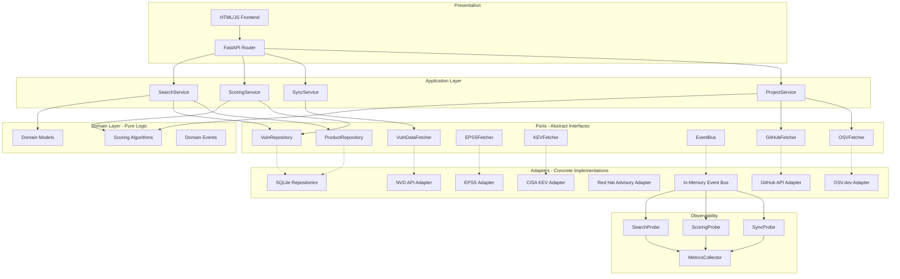
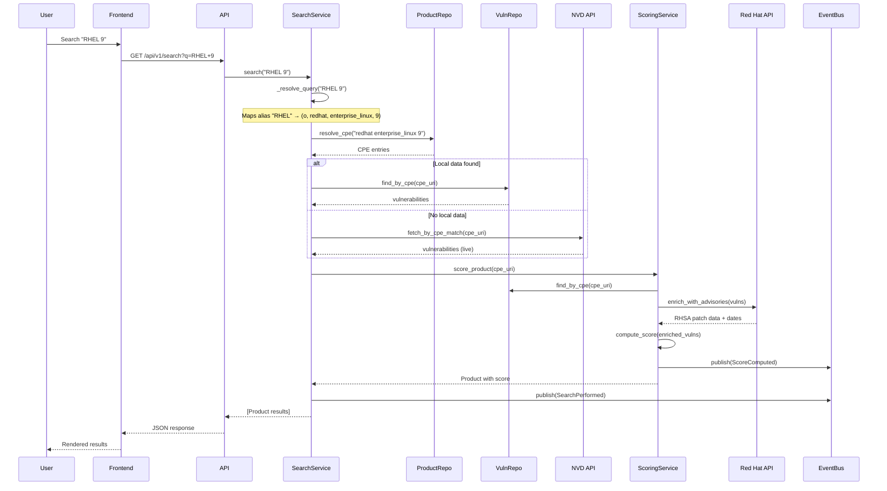
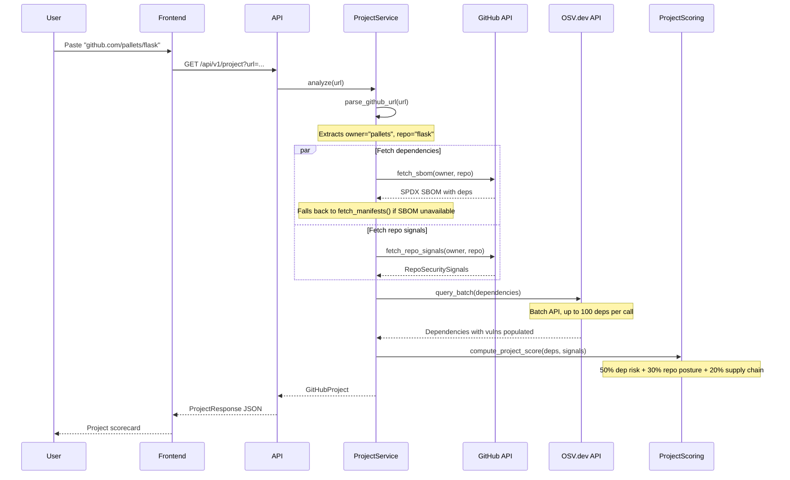
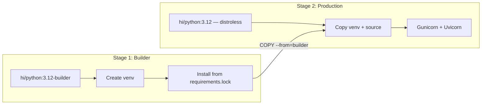
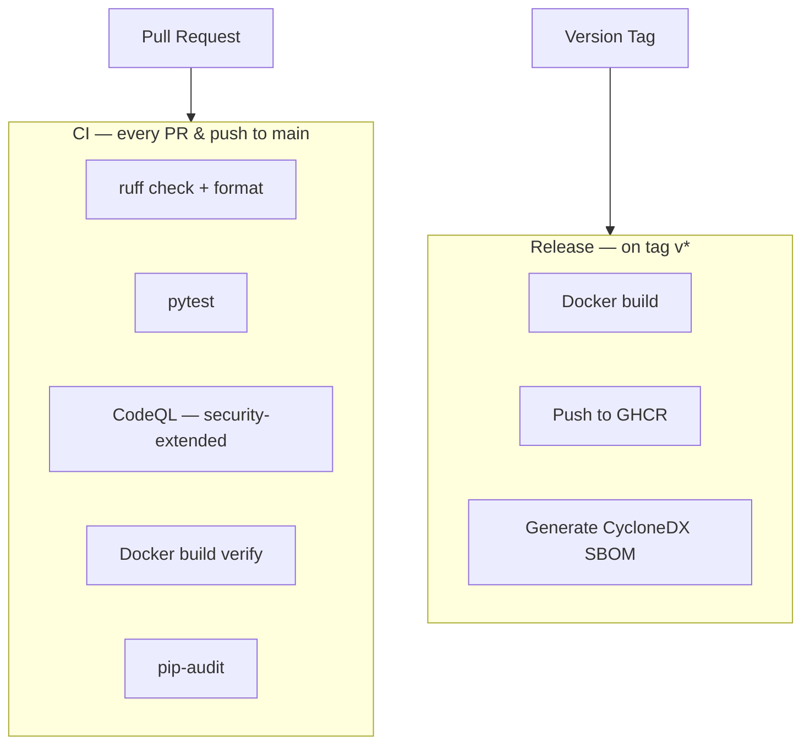

# Seclens Architecture & Design

Seclens is a security-focused search engine that scores the security posture of software products (via CPE) and GitHub projects (via repository URL). It aggregates data from multiple vulnerability databases, computes composite scores, and presents results through a minimal search UI.

## Table of Contents

- [System Overview](#system-overview)
- [High-Level Architecture](#high-level-architecture)
- [Data Flow: Product Search](#data-flow-product-search)
- [Data Flow: GitHub Project Analysis](#data-flow-github-project-analysis)
- [Data Flow: Sync Pipeline](#data-flow-sync-pipeline)
- [Layer Responsibilities](#layer-responsibilities)
- [Directory Structure](#directory-structure)
- [Technology Stack](#technology-stack)
- [Key Design Decisions](#key-design-decisions)

---

## System Overview

```
┌─────────────────────────────────────────────────────────────┐
│                       Frontend (HTML/JS/CSS)                │
│                 Minimal search UI, scorecards               │
└─────────────────────┬───────────────────────────────────────┘
                      │ HTTP (REST)
┌─────────────────────▼───────────────────────────────────────┐
│                     FastAPI Router                          │
│          /search  /products  /project  /sync                │
└─────────────────────┬───────────────────────────────────────┘
                      │
┌─────────────────────▼───────────────────────────────────────┐
│                  Application Services                       │
│     SearchService  ScoringService  SyncService              │
│                   ProjectService                            │
└──────┬──────────────┬───────────────┬───────────────────────┘
       │              │               │
┌──────▼──────┐ ┌─────▼─────┐ ┌──────▼──────┐
│   Domain    │ │   Ports   │ │ Observability│
│  Models &   │ │ (Abstract │ │  (Probes &   │
│  Scoring    │ │ Interfaces)│ │   Metrics)  │
└─────────────┘ └─────┬─────┘ └─────────────┘
                      │
┌─────────────────────▼───────────────────────────────────────┐
│                      Adapters                               │
│  SQLite Repos │ NVD │ EPSS │ KEV │ Red Hat │ GitHub │ OSV  │
└─────────────────────────────────────────────────────────────┘
```

## High-Level Architecture

Seclens follows **Hexagonal Architecture** (Ports & Adapters) with **Domain-Driven Design** principles:



## Data Flow: Product Search

When a user searches for a product like "RHEL 9":



## Data Flow: GitHub Project Analysis

When a user pastes a GitHub URL:



## Data Flow: Sync Pipeline

Background data synchronization:

```mermaid
sequenceDiagram
    participant Trigger as API/CLI Trigger
    participant SyncSvc as SyncService
    participant NVD as NVD API
    participant EPSS as EPSS API
    participant KEV as CISA KEV
    participant RedHat as Red Hat API
    participant DB as SQLite

    Trigger->>SyncSvc: sync_all()

    rect rgb(40, 40, 60)
        Note over SyncSvc,NVD: Phase 1: NVD Sync
        loop Batch (2000 per request)
            SyncSvc->>NVD: fetch_all(start_index, batch_size)
            NVD-->>SyncSvc: vulnerabilities + CPE data
            SyncSvc->>DB: save_vulnerabilities(vulns)
            SyncSvc->>DB: save_cpe_dictionary(cpes)
        end
    end

    rect rgb(40, 60, 40)
        Note over SyncSvc,EPSS: Phase 2: EPSS Sync
        SyncSvc->>EPSS: fetch_all_scores()
        EPSS-->>SyncSvc: exploit prediction scores
    end

    rect rgb(60, 40, 40)
        Note over SyncSvc,KEV: Phase 3: KEV Sync
        SyncSvc->>KEV: fetch_kev_ids()
        KEV-->>SyncSvc: known exploited CVE IDs
    end

    rect rgb(60, 40, 60)
        Note over SyncSvc,RedHat: Phase 4: Red Hat Advisory Sync
        SyncSvc->>DB: find_redhat_cve_ids()
        DB-->>SyncSvc: CVE IDs needing enrichment
        loop Batch (50 concurrent, 5 semaphore)
            SyncSvc->>RedHat: fetch_patches_batch(cve_ids)
            RedHat-->>SyncSvc: RHSA advisories + release_dates
            SyncSvc->>DB: update_patches(cve_id, patches)
        end
    end
```



## Layer Responsibilities

| Layer | Responsibility | Dependencies |
|-------|---------------|-------------|
| **Domain** | Pure business logic: models, scoring algorithms, events, exceptions. Zero I/O. | None (no imports from other layers) |
| **Ports** | Abstract interfaces (ABCs) defining what the application needs from infrastructure. | Domain models only |
| **Application** | Orchestration: coordinates ports to fulfill use cases. Contains no business rules. | Domain + Ports |
| **Adapters** | Concrete implementations of ports: HTTP clients, database queries, parsers. | Ports + external libraries |
| **API** | HTTP routing, request/response serialization, dependency injection wiring. | Application + Adapters |
| **Observability** | Event subscribers (probes) that collect metrics without polluting domain logic. | Domain Events + Metrics |
| **Frontend** | Static HTML/JS/CSS served by FastAPI. Makes REST calls to the API layer. | API (via HTTP) |

## Directory Structure

```
seclens/
├── docs/                          # Documentation (this directory)
├── frontend/                      # Static frontend assets
│   ├── index.html                 # Single-page search UI
│   └── static/
│       ├── css/style.css          # All styles
│       └── js/app.js              # All frontend logic
├── src/seclens/                   # Python source
│   ├── domain/                    # Business logic (no I/O)
│   │   ├── models/                # Data models
│   │   │   ├── product.py         # CPE, Product
│   │   │   ├── vulnerability.py   # Severity, PatchInfo, Vulnerability
│   │   │   ├── score.py           # ScoreBreakdown, SecurityScore
│   │   │   ├── dependency.py      # Dependency, DependencyVuln
│   │   │   ├── project.py         # GitHubProject, ProjectScore
│   │   │   └── repo_signals.py    # RepoSecuritySignals
│   │   ├── scoring.py             # Product scoring algorithm
│   │   ├── project_scoring.py     # Project scoring algorithm
│   │   ├── events.py              # Domain events
│   │   └── exceptions.py          # Custom exceptions
│   ├── ports/                     # Abstract interfaces
│   │   ├── repositories.py        # VulnRepository, ProductRepository
│   │   ├── data_fetchers.py       # VulnDataFetcher, EPSSFetcher, KEVFetcher
│   │   ├── event_bus.py           # EventBus
│   │   ├── github_fetcher.py      # GitHubFetcher
│   │   └── osv_fetcher.py         # OSVFetcher
│   ├── adapters/                  # Concrete implementations
│   │   ├── persistence/
│   │   │   └── sqlite_repository.py  # SQLite + FTS5
│   │   ├── fetchers/
│   │   │   ├── nvd_fetcher.py     # NVD API 2.0
│   │   │   ├── epss_fetcher.py    # EPSS scores
│   │   │   ├── kev_fetcher.py     # CISA KEV catalog
│   │   │   ├── redhat_fetcher.py  # Red Hat Security Data API
│   │   │   ├── github_fetcher.py  # GitHub REST API
│   │   │   ├── osv_fetcher.py     # OSV.dev batch API
│   │   │   └── manifest_parser.py # Dependency file parsers
│   │   └── events/
│   │       └── in_memory_bus.py   # Simple pub/sub
│   ├── application/               # Use case orchestration
│   │   ├── search_service.py      # Free-text → CPE → vulns → score
│   │   ├── scoring_service.py     # Score computation + advisory enrichment
│   │   ├── sync_service.py        # Data pipeline orchestration
│   │   └── project_service.py     # GitHub project analysis
│   ├── api/                       # HTTP layer
│   │   ├── router.py              # FastAPI routes
│   │   ├── schemas.py             # Pydantic DTOs
│   │   └── dependencies.py        # DI wiring
│   ├── observability/             # Observer-probe pattern
│   │   ├── metrics.py             # Structured metrics collector
│   │   └── probes/
│   │       ├── search_probe.py    # Search event observer
│   │       ├── scoring_probe.py   # Scoring event observer
│   │       └── sync_probe.py      # Sync event observer
│   └── main.py                    # Composition root, CLI
├── tests/                         # Test suite (70+ tests)
├── data/                          # Local SQLite DB (gitignored)
├── .github/                       # GitHub configs
│   ├── dependabot.yml             # Automated dependency updates
│   ├── secret_scanning.yml        # Push protection for secrets
│   ├── CODEOWNERS                 # Required reviewers
│   └── workflows/
│       ├── ci.yml                 # Lint + test + CodeQL + Docker build
│       └── release.yml            # Docker build + push on tags
├── Containerfile                  # Multi-stage Hummingbird build
├── compose.yml                    # Docker Compose for local dev
├── .dockerignore                  # Files excluded from image
├── .pre-commit-config.yaml        # Pre-commit hooks
├── .secrets.baseline              # detect-secrets baseline
├── requirements.lock              # Pinned production dependencies
├── pyproject.toml                 # Dependencies & build config
├── Makefile                       # Dev + Docker + security shortcuts
├── SECURITY.md                    # Vulnerability disclosure policy
├── CONTRIBUTING.md                # Development guidelines
└── AGENTS.md                      # AI agent instructions
```

## Technology Stack

| Component | Technology | Why |
|-----------|-----------|-----|
| Language | Python 3.11+ | Best ecosystem for security/ML tooling, async support |
| Web Framework | FastAPI | Async, auto-docs, Pydantic integration |
| Database | SQLite + FTS5 | Zero-config, embedded, full-text search built in |
| HTTP Client | httpx | Async, connection pooling, timeout handling |
| Frontend | Vanilla HTML/JS/CSS | Minimal, no build step, easily replaceable |
| Testing | pytest + pytest-asyncio | Standard, async-aware |
| Container Base | Red Hat Hummingbird (hi/python:3.12) | Distroless, zero CVEs, signed SBOM |
| CI/CD | GitHub Actions | Integrated with CodeQL, Dependabot, SBOM |
| Linting | ruff | Fast, all-in-one Python linter + formatter |
| Secret Scanning | detect-secrets (Yelp) | Pre-commit + GitHub push protection |
| Dep Auditing | pip-audit | Known vulnerability scanning for Python deps |

## Container Architecture

The production image uses a multi-stage build with Red Hat Hummingbird images:



- **Build stage**: `registry.access.redhat.com/hi/python:3.12-builder` — includes shell, dnf, pip for installing dependencies
- **Runtime stage**: `registry.access.redhat.com/hi/python:3.12` — distroless (no shell, no package manager), minimal attack surface, zero base image CVEs
- Non-root user via `CONTAINER_DEFAULT_USER`
- Health check on `/api/v1/health`
- `requirements.lock` ensures reproducible builds

## CI/CD Pipeline



### Pre-commit Hooks
- `ruff` lint + format
- `check-yaml`, `check-toml`, `check-json`
- `detect-secrets` with baseline
- `no-commit-to-branch` (protects `main`)
- `check-github-workflows`

## Key Design Decisions

### 1. Local-First with Live Fallback
Data is synced to a local SQLite database for fast searches. When local data is insufficient (e.g., a new product not yet synced), the system falls back to live NVD API queries. This provides both speed and freshness.

### 2. Scoring Accounts for Patch Status
Patched CVEs have their CVSS halved in severity scoring because the active risk is substantially reduced. This prevents well-maintained products like RHEL from being unfairly penalized for having many CVEs that are already fixed.

### 3. Logarithmic Scales for Volume Metrics
Vulnerability density and patch velocity use logarithmic curves instead of linear ones. This prevents heavily-audited products (which naturally have more CVEs discovered and fixed) from receiving artificially low scores.

### 4. Vendor-Specific Enrichment
The Red Hat advisory fetcher (`redhat_fetcher.py`) enriches NVD data with RHSA errata, including `release_date` for accurate patch velocity calculation. This pattern can be extended for other vendors (Ubuntu USN, Microsoft MSRC, etc.).

### 5. SBOM-First for GitHub Projects
GitHub project analysis tries the SBOM API first (which provides the complete dependency graph including transitive deps), falling back to manifest parsing only when SBOM is unavailable. This gives the most accurate picture of the dependency tree.

---

See also:
- [Design Principles](design-principles.md)
- [Domain Models](domain-models.md)
- [Scoring Algorithm](scoring.md)
- [Data Sources & Adapters](adapters.md)
- [API Reference](api-reference.md)
- [Frontend](frontend.md)
- [AGENTS.md](../AGENTS.md) (AI agent context)
