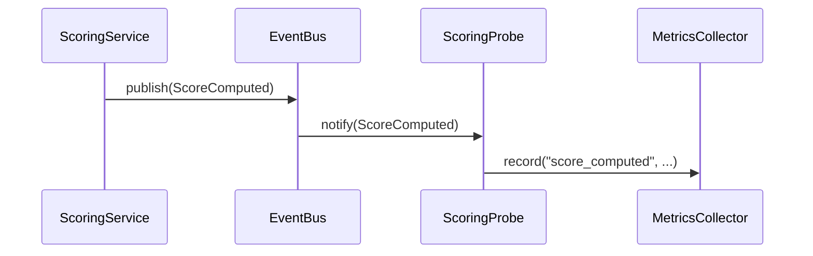

# Design Principles & Patterns

This document captures the architectural principles and design patterns used in seclens. These are not academic theory -- they are concrete decisions that shape how every file is written and how the system should evolve.

## Core Principles

### 1. Domain Logic is Pure

The domain layer (`domain/`) contains **zero I/O**. No HTTP calls, no database queries, no file reads. Domain models are dataclasses. Scoring algorithms are pure functions that take data in and return data out.

**Why**: Pure domain logic is trivially testable, easy to reason about, and immune to infrastructure changes. You can swap SQLite for PostgreSQL or NVD for a different feed without touching a single line of domain code.

**Test**: If a domain file imports `httpx`, `aiosqlite`, or any I/O library, something is wrong.

### 2. Ports Define Contracts, Adapters Implement Them

Every external dependency (database, API, event system) is accessed through an abstract interface (port). The concrete implementation (adapter) lives separately and is wired at the composition root.

```
Port:    ports/repositories.py    → VulnRepository (ABC)
Adapter: adapters/persistence/    → SQLiteVulnRepository
Wiring:  api/dependencies.py      → _vuln_repo = SQLiteVulnRepository(path)
```

**Why**: Swappability. When you need PostgreSQL instead of SQLite, you write a new adapter and change one line in `dependencies.py`. Application services never know or care.

### 3. Application Services Orchestrate, Don't Decide

Application services (`application/`) coordinate between ports to fulfill use cases. They contain workflow logic ("fetch deps, then query OSV, then score") but not business rules ("how to calculate a score"). Business rules live in the domain.

```python
# Good: orchestration in application layer
async def analyze(self, url: str) -> GitHubProject:
    deps = await self._github.fetch_sbom(owner, repo)
    deps = await self._osv.query_batch(deps)
    score = compute_project_score(deps, signals)  # Domain function

# Bad: business logic in application layer
async def analyze(self, url: str) -> GitHubProject:
    score = 100 - len(vulns) * 2  # This belongs in domain/
```

### 4. Scoring Reflects Reality, Not Theory

Scoring algorithms are designed around how security actually works in practice:

- **Patched CVEs are not the same as unpatched ones.** A critical CVE with a fix available is dramatically less risky than one without. The scoring system halves the CVSS of patched CVEs.

- **More CVEs found ≠ less secure.** Heavily-audited products (RHEL, Linux Kernel, Chrome) have hundreds of CVEs because they're thoroughly examined. Logarithmic scales prevent this from unfairly penalizing them.

- **Patch speed matters more than CVE count.** A product that patches in 30 days scores higher than one with fewer CVEs that takes 180 days to patch.

- **No exploit evidence ≠ neutral.** When EPSS data is unavailable, we default to 70 (positive lean), not 50 (neutral). Absence of exploitation evidence is mildly good news.

### 5. Local-First with Live Fallback

The primary data path is: sync data to local SQLite → query locally for speed. When local data is insufficient (product not synced yet), the system falls back to live NVD API queries. This gives both fast responses and comprehensive coverage.

### 6. Vendor Enrichment is Additive

NVD provides baseline CVE data, but vendor-specific sources (Red Hat RHSA, Ubuntu USN, Microsoft MSRC) add critical context -- especially patch dates. The enrichment pattern is:

1. Load base data from NVD
2. For vendor-matched CVEs, fetch advisory data in parallel
3. Merge advisory patches into the vulnerability record
4. Score using the enriched data

New vendors are added by creating an adapter and injecting it. No domain changes needed.

## Design Patterns

### Hexagonal Architecture (Ports & Adapters)

The core pattern organizing the entire codebase. The domain sits at the center, ports define its boundaries, and adapters connect it to the outside world.

```
        ┌──────────────────────────────┐
        │         Adapters             │
        │  ┌────────────────────────┐  │
        │  │     Application        │  │
        │  │  ┌──────────────────┐  │  │
        │  │  │     Domain       │  │  │
        │  │  │  (pure logic)    │  │  │
        │  │  └──────────────────┘  │  │
        │  │      via Ports         │  │
        │  └────────────────────────┘  │
        └──────────────────────────────┘
```

**Dependency rule**: Dependencies point inward. Domain imports nothing. Ports import domain models. Application imports domain + ports. Adapters import ports. API imports everything and wires it together.

### Observer-Probe Pattern

Domain events decouple business actions from observability concerns. When a score is computed, the domain doesn't log metrics -- it publishes a `ScoreComputed` event. A probe subscribes to that event and records metrics.



**Components**:
- **Events** (`domain/events.py`): `SearchPerformed`, `ScoreComputed`, `DataSyncCompleted`
- **Bus** (`adapters/events/in_memory_bus.py`): Simple topic-based pub/sub
- **Probes** (`observability/probes/`): Stateless subscribers that record metrics
- **Collector** (`observability/metrics.py`): Accumulates counters and histograms

**Why probes instead of direct logging**: Domain logic stays clean. You can add/remove probes without modifying business code. Different environments can wire different probes (e.g., Prometheus probe for production, logging probe for development).

### Composition Root

All dependency injection happens in one place: `api/dependencies.py`. This is the only file that knows about concrete adapter classes. Everything else works with abstract ports.

```python
# Singletons (created once)
_vuln_repo = SQLiteVulnRepository(_DB_PATH)
_nvd_fetcher = NVDFetcher()
_github_fetcher = GitHubApiFetcher()

# Factory functions (called per request)
def get_search_service() -> SearchService:
    return SearchService(_product_repo, _vuln_repo, _event_bus, vuln_fetcher=_nvd_fetcher)
```

### Strategy Pattern in Scoring

Scoring factors are independent functions that each return a 0-100 score. The composite score applies weights. Adding a new factor requires:

1. Write a `_score_new_factor(vulns)` function in `domain/scoring.py`
2. Add the field to `ScoreBreakdown`
3. Add the weight in `SecurityScore.create()`
4. Update the frontend display

No existing code changes needed beyond the weight rebalancing.

## Conventions

### File Naming

- Domain models: noun, singular (`product.py`, `vulnerability.py`)
- Adapters: `{vendor/tech}_{role}.py` (`nvd_fetcher.py`, `sqlite_repository.py`)
- Application services: `{noun}_service.py` (`search_service.py`)
- Tests: `test_{module}.py` matching the source file

### Error Handling

- Domain: raise custom exceptions from `domain/exceptions.py`
- Adapters: catch external errors, log with `logger.warning()`, return safe defaults
- API: translate exceptions to HTTP status codes in the router

### Async Everywhere

All I/O operations are `async`. The domain layer is synchronous (pure functions). Application services are async because they call ports. Use `asyncio.gather()` for concurrent operations and `asyncio.Semaphore()` for rate limiting.

### Testing

- Domain tests: pure unit tests, no mocks needed
- Adapter tests: integration tests with real (but ephemeral) resources
- API tests: use `httpx.AsyncClient` with FastAPI's `TestClient`
- All async tests use `pytest-asyncio` with `pytest.mark.asyncio`
