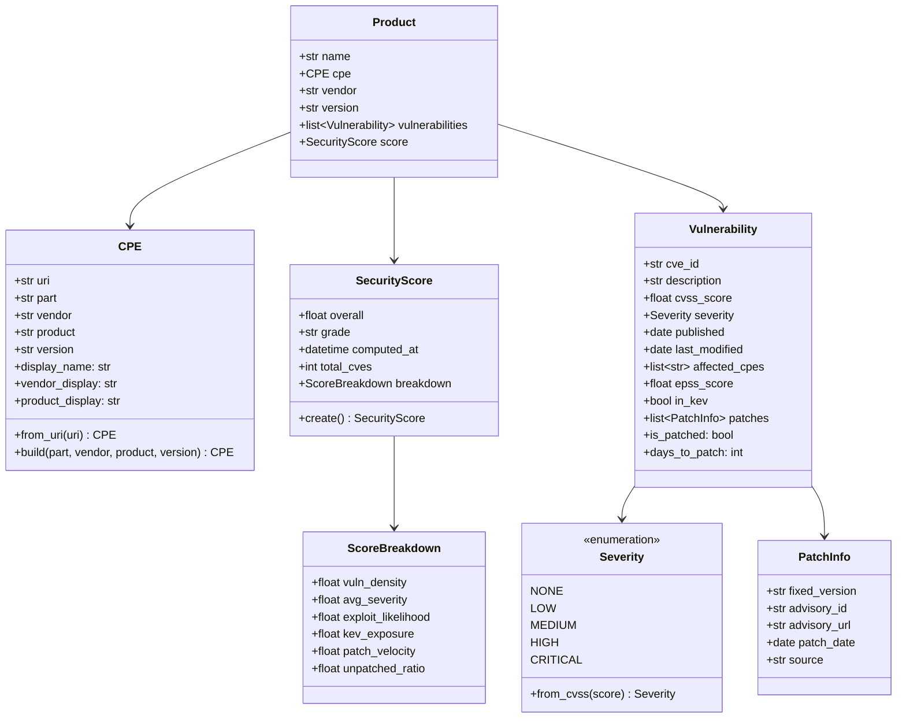

# Domain Models

All domain models live in `src/seclens/domain/models/` and are pure Python dataclasses with no I/O dependencies. They are frozen (immutable) where possible to prevent accidental mutation.

## Model Hierarchy

## Product Models (`product.py`)

### CPE (Common Platform Enumeration)

Represents a standardized identifier for IT products. Format: `cpe:2.3:{part}:{vendor}:{product}:{version}:*:*:*:*:*:*:*`

| Field | Type | Description |
|-------|------|-------------|
| `uri` | `str` | Full CPE 2.3 URI string |
| `part` | `str` | `a` (application), `o` (OS), `h` (hardware) |
| `vendor` | `str` | Vendor name (e.g., `redhat`, `openssl`) |
| `product` | `str` | Product name (e.g., `enterprise_linux`) |
| `version` | `str` | Version (e.g., `9.0`, `*` for any) |

**Aliases**: The `PRODUCT_ALIASES` dict maps common names to CPE tuples:
- `"rhel"` → `("o", "redhat", "enterprise_linux")`
- `"openssl"` → `("a", "openssl", "openssl")`
- `"linux"` → `("o", "linux", "linux_kernel")`

**Display names**: `VENDOR_DISPLAY` and `PRODUCT_DISPLAY` dicts provide human-readable names, and the `display_name` property avoids redundancy (e.g., "OpenSSL" not "OpenSSL OpenSSL").

### Product

A software product with its CPE, vulnerability list, and security score.

## Vulnerability Models (`vulnerability.py`)

### Severity

Enum mapping CVSS scores to severity levels:
- `NONE`: 0.0
- `LOW`: 0.1 - 3.9
- `MEDIUM`: 4.0 - 6.9
- `HIGH`: 7.0 - 8.9
- `CRITICAL`: 9.0 - 10.0

### PatchInfo

Represents a known fix for a vulnerability. Sources include NVD version exclusion data and vendor-specific advisories (e.g., RHSA errata from Red Hat).

| Field | Type | Description |
|-------|------|-------------|
| `fixed_version` | `str \| None` | Version that fixes the CVE |
| `advisory_id` | `str \| None` | Advisory identifier (e.g., `RHSA-2024:1332`) |
| `advisory_url` | `str \| None` | Link to advisory page |
| `patch_date` | `date \| None` | When the patch was released |
| `source` | `str` | Origin: `"nvd"` or `"redhat"` |

### Vulnerability

A single CVE record enriched with scoring, exploit, and patch metadata.

Key computed properties:
- `is_patched` → `True` if any `PatchInfo` exists
- `days_to_patch` → Days between `published` date and earliest `patch_date`

## Score Models (`score.py`)

### ScoreBreakdown

Six individual factors, each 0-100 (higher = more secure):

| Factor | What it measures |
|--------|-----------------|
| `vuln_density` | CVEs per year of product life (log scale) |
| `avg_severity` | Mean effective CVSS (patched CVEs at half weight) |
| `exploit_likelihood` | Mean EPSS probability |
| `kev_exposure` | Ratio on CISA KEV list |
| `patch_velocity` | Median days to fix (logistic curve) |
| `unpatched_ratio` | Percentage without known fix |

### SecurityScore

Composite score with weighted breakdown. Grade uses academic thresholds (A+ = 97-100, F < 60).

**Weights**: KEV Exposure 20%, Patch Velocity 20%, Unpatched Ratio 20%, Avg Severity 15%, Exploit Likelihood 15%, Vuln Density 10%.

## GitHub Project Models

### Dependency (`dependency.py`)

A software dependency of a GitHub project.

| Field | Type | Description |
|-------|------|-------------|
| `name` | `str` | Package name |
| `version` | `str` | Pinned version |
| `ecosystem` | `str` | `PyPI`, `npm`, `Go`, `crates.io`, `Maven`, `RubyGems` |
| `is_direct` | `bool` | Direct dependency vs transitive |
| `vulnerabilities` | `list[DependencyVuln]` | Known vulnerabilities from OSV |

### DependencyVuln

A vulnerability record from OSV.dev affecting a dependency.

| Field | Type | Description |
|-------|------|-------------|
| `vuln_id` | `str` | OSV/GHSA identifier |
| `aliases` | `list[str]` | CVE aliases |
| `severity` | `str` | CRITICAL/HIGH/MEDIUM/LOW/UNKNOWN |
| `cvss_score` | `float \| None` | CVSS score if available |
| `fixed_version` | `str \| None` | Version that resolves the vuln |
| `url` | `str` | Link to OSV.dev vulnerability page |

### RepoSecuritySignals (`repo_signals.py`)

Security-relevant metadata about a GitHub repository.

| Field | Type | Description |
|-------|------|-------------|
| `default_branch_protected` | `bool \| None` | Branch protection rules enabled |
| `secret_scanning_enabled` | `bool \| None` | GitHub secret scanning active |
| `code_scanning_enabled` | `bool \| None` | CodeQL or similar active |
| `dependabot_enabled` | `bool \| None` | Vulnerability alerts enabled |
| `license_name` | `str \| None` | SPDX license identifier |
| `last_push_date` | `date \| None` | Most recent push |
| `archived` | `bool` | Repository is archived |
| `fork` | `bool` | Repository is a fork |

### GitHubProject (`project.py`)

Top-level model for a GitHub project analysis result.

### ProjectScore

Composite project score with three-factor breakdown:
- **Dependency Risk (50%)**: Vulnerability count, severity, fix availability
- **Repo Posture (30%)**: Security configuration and maintenance
- **Supply Chain (20%)**: Version pinning, direct vs transitive exposure
