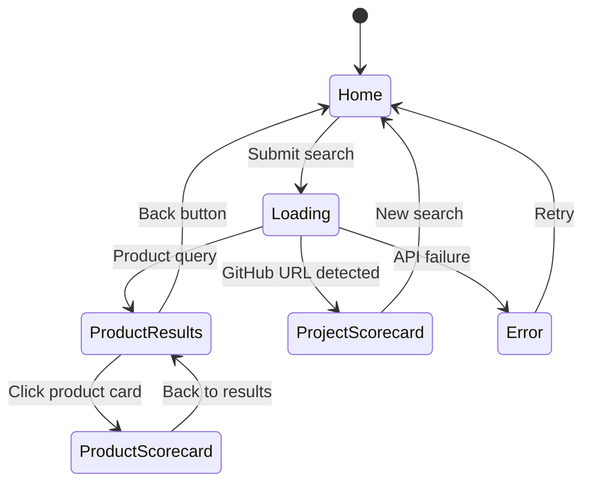

# Frontend Architecture

The frontend is a single-page application built with vanilla HTML, CSS, and JavaScript. It has no build step, no framework dependencies, and is served as static files by FastAPI.

## File Structure

```
frontend/
├── index.html              # Main HTML (search bar, scoring info, quick links)
└── static/
    ├── css/
    │   └── style.css       # All styles (CSS custom properties, responsive)
    └── js/
        └── app.js          # All application logic (~400 lines)
```

## Design Philosophy

- **Minimal and replaceable**: The frontend can be swapped for React/Vue/Svelte without touching the backend. All communication is via REST API.
- **No build step**: Edit, refresh, done. No webpack, no npm, no node_modules.
- **Dark theme**: Default dark color scheme with CSS custom properties for easy theming.

## Application Flow



## Key Modules in `app.js`

### Search Router

The `performSearch()` function detects GitHub URLs via regex and routes accordingly:

```
if (isGitHubUrl(query))  → analyzeProject(url)
else                      → fetch /api/v1/search
```

### Product Scorecard

`renderScorecard(name, cpe, score, vulns)` renders:
1. Score badge with grade
2. Severity chips (Critical/High/Medium/Low counts)
3. Breakdown grid with bar charts
4. Paginated vulnerability list with filters

### Project Scorecard

`renderProjectScorecard(project)` renders:
1. Project name linked to GitHub
2. Three-factor breakdown (Dependency Risk, Repo Posture, Supply Chain)
3. Repository security signals checklist
4. Paginated dependency table with vulnerability details

### Pagination System

Both CVE lists and dependency tables use the same pagination pattern:

- `VULNS_PER_PAGE = 25` / `PROJECT_DEPS_PER_PAGE = 20`
- State variables: `_currentPage`, `_currentFilter`, `_currentItems`
- `paginationRange()` generates smart page numbers with ellipsis
- Filter buttons use `data-filter` attributes and toggle `.active` class

### CVE Links

Each CVE ID links to its NVD page: `https://nvd.nist.gov/vuln/detail/{CVE-ID}`

Patched CVEs also show advisory links (e.g., RHSA errata links for Red Hat products).

## CSS Architecture

### Custom Properties (Theming)

All colors are defined as CSS custom properties on `:root`, making theme changes trivial:

```css
:root {
    --bg: #0d1117;
    --surface: #161b22;
    --border: #30363d;
    --text: #e6edf3;
    --text-muted: #8b949e;
    --accent: #58a6ff;
    --green: #3fb950;
    --red: #f85149;
    --orange: #d29922;
    --yellow: #e3b341;
    --critical: #f85149;
}
```

### Component Classes

| Class | Purpose |
|-------|---------|
| `.product-card` | Clickable search result with score badge |
| `.scorecard-header` | Score display with grade and title |
| `.breakdown-grid` | Grid of score factor bars |
| `.vuln-item` | Individual CVE entry |
| `.dep-item` | Individual dependency entry |
| `.signal-item` | Repo security signal checkbox |
| `.filter-btn` | Severity/status filter button |
| `.page-btn` | Pagination button |
| `.tag` | Status badges (patched, unpatched, KEV) |

### Responsive Design

The layout adapts at 600px breakpoint:
- Product cards switch from grid to single column
- Score badges reflow horizontally
- Breakdown grid goes single column

## Extending the Frontend

### Adding a new view

1. Add HTML structure to `index.html` (with `hidden` class)
2. Add render function in `app.js` (pattern: `renderXxx(data)`)
3. Wire into search router or add navigation link
4. Add styles in `style.css`

### Adding filters

Follow the pattern in `filterVulns()`:
1. Add filter button with `data-filter` attribute
2. Add filter function that updates state and calls render
3. The render function reads the filter state and slices data

### Replacing the frontend

The backend serves the frontend from `frontend/` via FastAPI `StaticFiles`. To swap:
1. Build your React/Vue/Svelte app into `frontend/`
2. Ensure `index.html` is at `frontend/index.html`
3. Static assets go in `frontend/static/`
4. No backend changes needed -- all API contracts remain the same
