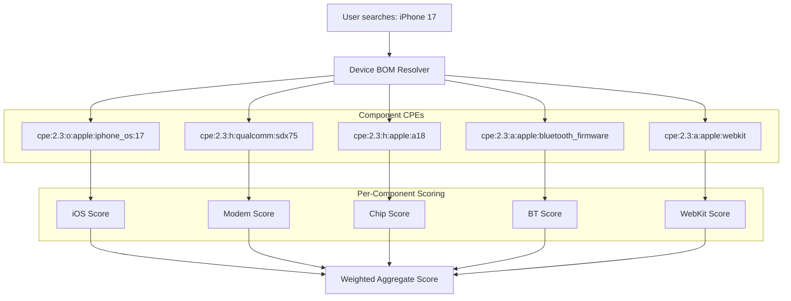

# Seclens Roadmap

Future features and enhancements, roughly ordered by priority.

---

## 1. Hardware Device Scoring (Device BOM)

**Status**: Planned

### Problem

Seclens currently scores the *software/firmware* running on a device, not the device as a whole. Searching "iPhone 17" returns iOS CVEs but ignores the baseband modem, Bluetooth stack, Wi-Fi firmware, GPU drivers, and SoC-level vulnerabilities. A device is only as secure as its weakest component.

### Approach: Device Bill of Materials (Device BOM)

Map consumer devices and enterprise hardware to their constituent components, then aggregate CVEs across all of them into a composite device score.



### Data Model

```python
@dataclass
class DeviceComponent:
    name: str                    # "Baseband Modem"
    cpe: CPE                     # cpe:2.3:h:qualcomm:sdx75
    category: str                # "modem", "soc", "os", "firmware", "driver"
    exposure: float              # 0.0-1.0 — remote=1.0, local=0.3, physical=0.1
    score: SecurityScore | None

@dataclass
class DeviceBOM:
    device_name: str             # "Apple iPhone 17"
    vendor: str
    model: str
    components: list[DeviceComponent]
    overall_score: SecurityScore
```

### Component Weight by Exposure

Not all components carry equal risk. A remotely-exploitable modem CVE is far more dangerous than a USB controller CVE requiring physical access.

| Category | Exposure | Weight | Rationale |
|----------|----------|--------|-----------|
| OS / Firmware | Remote (always-on) | 30% | Largest attack surface, most CVEs |
| Baseband Modem | Remote (always-on) | 20% | Network-facing, often separate processor |
| Browser Engine | Remote (user-triggered) | 15% | Primary web attack vector |
| Wi-Fi / Bluetooth | Proximity | 15% | Wireless attack surface |
| SoC / CPU | Local | 10% | Spectre/Meltdown class, requires local code exec |
| Drivers / Other | Local / Physical | 10% | USB, GPU, sensors |

### Data Source Challenge

There is no standard "device to components" database. Possible approaches:

1. **Curated mappings** (short-term): Hand-built YAML files mapping popular devices to their known components. Start with top 20 devices (iPhone, Pixel, Galaxy, Cisco ASA, etc.).

2. **FCC/iFixit teardown data** (medium-term): Scrape or license teardown databases that list components per device model.

3. **Vendor security bulletins** (medium-term): Apple, Samsung, Qualcomm, and Intel publish security bulletins that implicitly reveal component relationships (e.g., "affects iPhone 15 with Qualcomm X70 modem").

4. **Community-contributed** (long-term): Allow users to submit device BOM mappings, review and merge.

### Implementation Steps

1. Create `domain/models/device.py` with `DeviceComponent`, `DeviceBOM` models
2. Create `ports/device_registry.py` abstract interface
3. Create `adapters/device/yaml_registry.py` backed by curated YAML files
4. Create `data/devices/` directory with YAML device definitions
5. Create `domain/device_scoring.py` with weighted component aggregation
6. Create `application/device_service.py` orchestrator
7. Add `GET /api/v1/device?q={query}` endpoint
8. Add device scorecard rendering to frontend
9. Add device detection to search router (alongside product and GitHub URL detection)

### Example Device YAML

```yaml
# data/devices/apple/iphone_17.yml
name: Apple iPhone 17
vendor: apple
model: iphone_17
components:
  - name: iOS
    cpe_pattern: "cpe:2.3:o:apple:iphone_os:{version}"
    category: os
    exposure: 1.0
  - name: A18 Pro SoC
    cpe_pattern: "cpe:2.3:h:apple:a18_pro"
    category: soc
    exposure: 0.3
  - name: Qualcomm X75 Modem
    cpe_pattern: "cpe:2.3:h:qualcomm:sdx75"
    category: modem
    exposure: 1.0
  - name: WebKit
    cpe_pattern: "cpe:2.3:a:apple:webkit:{version}"
    category: browser_engine
    exposure: 0.8
  - name: Bluetooth Firmware
    cpe_pattern: "cpe:2.3:a:apple:bluetooth_firmware"
    category: wireless
    exposure: 0.6
```

---

## 2. Privacy Scorecard

**Status**: Implemented (MVP)

Score the privacy posture of a product or service, separate from the security score. Privacy score appears alongside the security score in search results.

**Implemented:**
- ToS;DR integration (privacy policy grade + individual points)
- Have I Been Pwned integration (breach history)
- Disconnect tracker list (advertising, analytics, fingerprinting)
- PrivacySpy dataset (community-scored privacy policies)
- 5-factor scoring: Data Collection (25%), Policy Practices (25%), Tracker Exposure (20%), Breach History (20%), Data Sharing (10%)
- Service mapping: 35+ products mapped to service identities
- Privacy scorecard in frontend (side-by-side with security score, privacy signals, breach list)

**Future enhancements:**
- Mobile app sources (Exodus Privacy for Android, Apple App Privacy Labels)
- GDPR/CCPA compliance signals
- Permission scope analysis for mobile apps
- More curated service mappings

---

## 3. Vendor Enrichment Expansion

**Status**: Planned — extend the Red Hat advisory pattern to other vendors.

| Vendor | API | Priority |
|--------|-----|----------|
| Ubuntu / Canonical | USN (Ubuntu Security Notices) | High |
| Microsoft | MSRC (Microsoft Security Response Center) | High |
| Debian | DSA (Debian Security Advisories) | Medium |
| Google (Android/Chrome) | Android Security Bulletins | Medium |
| Apple | Apple Security Releases | Medium |
| Cisco | Cisco Security Advisories (PSIRT) | Medium |

Each follows the same adapter pattern: implement `fetch_patches_for_cve()` and `fetch_patches_batch()`, parse into `PatchInfo` objects.

---

## 4. Historical Score Tracking

**Status**: Planned

Track score changes over time to show trends:
- Store scores with timestamps in SQLite
- "Score over time" sparkline/chart on scorecards
- Detect score regressions (new critical unpatched CVE)
- Weekly email/webhook digest of score changes for watched products

---

## 5. Comparison Mode

**Status**: Idea

Side-by-side comparison of two products or devices:
- "RHEL 9 vs Ubuntu 24.04"
- "iPhone 17 vs Pixel 10"
- Radar chart overlay of scoring factors

---

## 6. API Keys and Rate Limiting

**Status**: Planned (for hosted deployment)

- API key issuance and management
- Rate limiting per key
- Usage dashboards
- Webhook subscriptions for score change notifications

---

## 7. Proto / gRPC Support

**Status**: Deferred

Add protobuf definitions and gRPC serving alongside REST for:
- CLI clients talking to a remote seclens server
- CI/CD pipeline integrations (gRPC call in build step)
- Multi-service architectures where seclens is a microservice

Currently deferred — revisit when seclens has multiple consumers.
